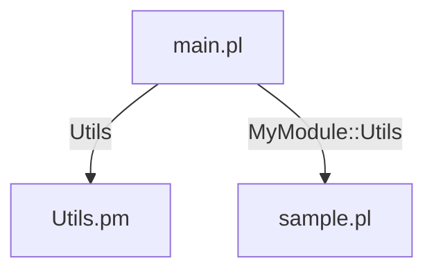

# MCP Server CodeGraph with Perl Support

A Model Context Protocol (MCP) server that provides graph representation of codebases with comprehensive Perl language support. This server can analyze Perl code to extract entities (packages, subroutines, variables, imports) and their relationships (function calls, dependencies).

## Features

- **Multi-language support**: Currently supports Perl (.pl, .pm, .t, .cgi files)
- **Entity extraction**: Identifies packages, subroutines, variables, and imports
- **Relationship mapping**: Tracks function calls and dependencies
- **MCP compatibility**: Works with any MCP-compatible client
- **TypeScript implementation**: Modern, maintainable codebase

## Prerequisites

- Node.js 16+ (recommended: Node.js 18+)
- npm or yarn package manager

## Installation & Setup

### 1. Clone and Install Dependencies

```bash
# Clone the repository (if not already done)
git clone <repository-url>
cd mcp-server-codegraph

# Install dependencies
npm install

# Build the project
npm run build
```

### 2. Local Development

For development with auto-rebuild on changes:

```bash
npm run dev
```

## Usage

### Running the Server

The MCP server takes a directory path as an argument and analyzes all supported files within it:

```bash
# Basic usage - analyze current directory
node dist/index.js .

# Analyze a specific directory
node dist/index.js /path/to/your/perl/project

# Analyze with home directory expansion
node dist/index.js ~/my-perl-project
```

### Available Tools

The server provides four main tools via the MCP protocol:

1. **`index`** - Indexes the entire codebase
2. **`list_file_entities`** - Lists all entities in a specific file
3. **`list_entity_relationships`** - Shows relationships for a specific entity
4. **`generate_mermaid`** - Generates Mermaid diagrams from the indexed codebase

### Testing the Server

We've included test scripts to verify functionality:

```bash
# Test basic functionality
node test_mcp.js

# Test relationship mapping
node test_relationships.js
```

### Example with Perl Code

Given a Perl file like this:

```perl
#!/usr/bin/perl
package MyModule::Utils;

use strict;
use warnings;
use Data::Dumper qw(Dumper);

sub new {
    my $class = shift;
    my $self = { data => [] };
    return bless $self, $class;
}

sub process_data {
    my ($self, $input) = @_;
    return $self->transform_item($input);
}

sub transform_item {
    my ($self, $item) = @_;
    return uc($item);
}
```

The server will identify:
- **Package**: `MyModule::Utils`
- **Functions**: `new`, `process_data`, `transform_item`
- **Variables**: `$class`, `$self`
- **Import**: `Data::Dumper`
- **Relationships**: `process_data` calls `transform_item`

## Integration with MCP Clients

### Using with Cline/Claude Dev

1. Build the server: `npm run build`
2. Add to your MCP configuration:

```json
{
  "mcpServers": {
    "codegraph": {
      "command": "node",
      "args": ["/path/to/mcp-server-codegraph/dist/index.js", "/path/to/analyze"],
      "env": {}
    }
  }
}
```

### Using with Other MCP Clients

The server follows the standard MCP protocol and can be integrated with any MCP-compatible client by:

1. Starting the server with: `node dist/index.js <directory>`
2. Communicating via JSON-RPC over stdio
3. Using the available tools: `index`, `list_file_entities`, `list_entity_relationships`

## API Reference

### Tool: `index`

Indexes the entire codebase and creates a graph of entities and relationships. **Automatically generates multiple visualization formats.**

**Input**: None
**Output**: Success message with statistics and list of generated files

**Generated Files**:
- `index.json` - Raw graph data (nodes and relationships)
- `codegraph.dot` - GraphViz DOT format for professional diagrams
- `codegraph-d3.json` - D3.js format for interactive web visualizations
- `codegraph-cytoscape.json` - Cytoscape format for network analysis

**Visualization Tools**:
- **GraphViz DOT**: Use with Graphviz, VS Code GraphViz extensions, yEd, online DOT viewers
- **D3.js JSON**: Perfect for Observable notebooks, custom web apps, interactive dashboards
- **Cytoscape JSON**: Compatible with Cytoscape desktop app, Gephi, network analysis tools

### Tool: `list_file_entities`

Lists all entities within a specified file.

**Input**:
```json
{
  "path": "relative/path/to/file.pl"
}
```

**Output**: Array of entities with names, types, and locations

### Tool: `list_entity_relationships`

Lists relationships for a specific entity.

**Input**:
```json
{
  "path": "relative/path/to/file.pl",
  "name": "entity_name"
}
```

**Output**: Array of relationships showing source, target, and relationship type

### Tool: `generate_mermaid`

Generates Mermaid diagrams from the indexed codebase.

**Input**:
```json
{
  "type": "dependency" | "entity"
}
```

**Types**:
- **`dependency`**: Creates a clean file-level dependency diagram showing which files import which other files
- **`entity`**: Creates a detailed diagram with subgraphs showing entities within each file

**Output**: Mermaid diagram code and saves `.mmd` files to the analyzed directory

**Example Dependency Diagram**:


**Features**:
- **Color-coded nodes**: Different colors for `.pl` (scripts), `.pm` (modules), `.cgi` (CGI scripts)
- **Labeled relationships**: Shows which modules are imported
- **Clean file names**: Displays just the filename for readability
- **Automatic styling**: Includes CSS classes for professional appearance

## Supported Perl Constructs

- **Packages**: `package MyModule;`
- **Imports**: `use Module;`, `require Module;` (creates file-level dependencies)
- **File Extensions**: `.pl`, `.pm`, `.cgi` (excludes `.t` test files)
- **Cross-File Resolution**: Maps package names to actual files
- **File-Level Dependencies**: Tracks which files depend on which other files
- **CPAN Module Filtering**: Automatically ignores external CPAN modules to focus on project code

### CPAN Module Filtering

The analyzer automatically filters out CPAN modules to focus on your project's internal dependencies:

**Filtered Out**:
- Common CPAN modules (Data::Dumper, JSON::PP, DBI, LWP::UserAgent, etc.)
- Perl pragmas (strict, warnings, utf8, feature)
- Core modules (File::*, List::*, etc.)
- Modules with common CPAN namespaces (DateTime::, Template::, etc.)
- Deep module hierarchies (3+ levels like Some::Deep::Module)

**Included**:
- Project-specific modules
- Local packages and libraries
- Custom modules in your codebase

## Development

### Project Structure

```
src/
├── types/           # Type definitions
├── utils/           # Utility functions
├── analyzers/       # Language analyzers
├── core/           # Core indexing logic
└── index.ts        # Main server entry point
```

### Adding Language Support

To add support for additional languages:

1. Create a new analyzer in `src/analyzers/`
2. Extend `AbstractAnalyzer`
3. Add language detection in `src/utils/languageDetection.ts`
4. Update the `AnalyzerFactory`

### Building

```bash
# Development build with watch
npm run dev

# Production build
npm run build
```

## Troubleshooting

### Common Issues

1. **"Cannot find module" errors**: Run `npm install` to ensure all dependencies are installed
2. **Permission errors**: Make sure the target directory is readable
3. **Node version issues**: Ensure you're using Node.js 16 or higher

### Debug Mode

For debugging, you can add console.log statements and rebuild:

```bash
npm run build
node dist/index.js your-directory
```

## Contributing

1. Fork the repository
2. Create a feature branch
3. Make your changes
4. Add tests if applicable
5. Submit a pull request

## License

MIT License - see LICENSE file for details.
